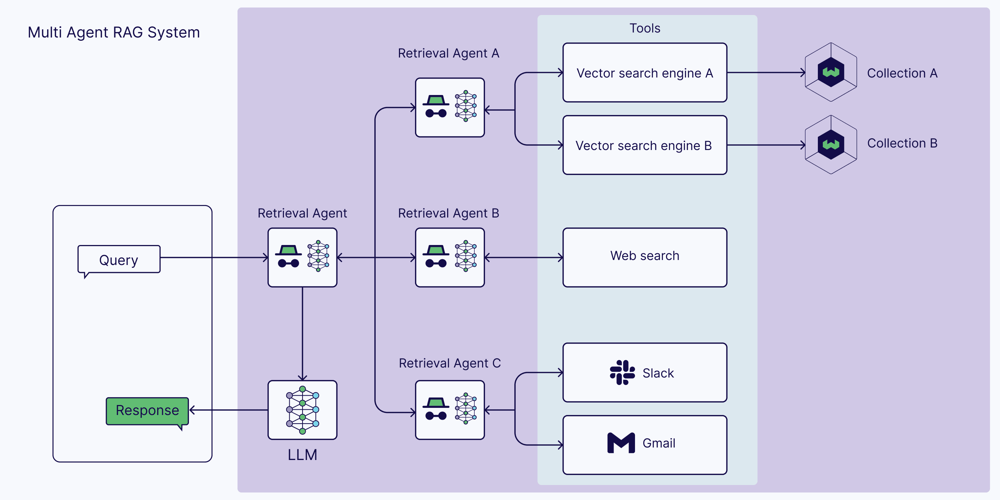

# Multi-Agent RAG System (PydanticAI & Google Gemini)

This project implements a Retrieval-Augmented Generation (RAG) system using multiple AI agents orchestrated by the PydanticAI library. It leverages Google's Gemini models for advanced language understanding and generation, Google's embedding API for semantic search capabilities, and Qdrant as a high-performance vector database for storing and retrieving knowledge.

## Architecture

The system employs a multi-agent approach where different agents handle specific tasks. A Router Agent first determines the best strategy (vector search vs. web search) to answer a user query. Based on this, either a specialized RAG Agent or a Web Search Agent takes over.


*(**Note:** You need to create an `images` folder in the project root and place the `multi-agent-rag.png` file inside it for this image to display correctly)*

## Key Features

*   **Multi-Agent Design:** Utilizes separate agents for routing, knowledge retrieval (RAG), and web searching, allowing for specialized logic and prompts.
*   **Intelligent Routing:** A Router Agent uses a powerful Gemini model (e.g., `gemini-1.5-pro`) to decide whether to query the internal knowledge base or search the web based on the user's question.
*   **Retrieval-Augmented Generation (RAG):** A RAG Agent retrieves relevant text chunks from a Qdrant vector database using semantic similarity search (powered by Google Embeddings) and generates answers *strictly* based on the retrieved context.
*   **Web Search Capability:** A Web Search Agent uses DuckDuckGo to find current information or general knowledge answers when the internal knowledge base is not suitable.
*   **PydanticAI Orchestration:** Leverages PydanticAI for defining agents, managing tools, handling structured output (for routing), and simplifying interaction with language models.
*   **Google Cloud Integration:** Natively uses Google Gemini large language models and Google's embedding API.
*   **Qdrant Vector Database:** Employs Qdrant for efficient storage and fast retrieval of text embeddings.
*   **Configurable:** Easily configure API keys, model names, Qdrant settings, and agent parameters via `.env` and `config.py`.
*   **Asynchronous:** Built using Python's `asyncio` for potentially concurrent operations.

## Setup Instructions

1.  **Prerequisites:**
    *   Python 3.8 or newer installed.
    *   Git installed (for cloning, optional if downloading).
    *   Docker installed and running (if using Qdrant locally via Docker).

2.  **Get the Code:**
    Clone the repository or download the project files into a directory (e.g., `Multi-Agent-RAG`).
    ```bash
    git clone <your-repo-url> # Or download/extract zip
    cd Multi-Agent-RAG
    ```

3.  **Create Virtual Environment:**
    Isolate project dependencies using a virtual environment.
    ```bash
    python -m venv venv
    ```

4.  **Activate Virtual Environment:**
    *   **Windows:** `.\venv\Scripts\activate`
    *   **macOS/Linux:** `source venv/bin/activate`
    *(Your terminal prompt should now show `(venv)`)*

5.  **Install Dependencies:**
    Install all required Python libraries.
    ```bash
    pip install -r requirements.txt
    ```

6.  **Configure `.env` File:**
    *   Create a file named `.env` in the project's root directory (`Multi-Agent-RAG/`).
    *   Open `.env` and add your **Google API Key**. This key is essential for both generating embeddings and running the Gemini models used by the agents.
        ```dotenv
        # --- .env ---
        GOOGLE_API_KEY="YOUR_ACTUAL_GOOGLE_API_KEY_HERE"

        # Optional: Uncomment and set if Qdrant is not at localhost:6333
        # QDRANT_URL="http://your_qdrant_host:6333"
        # Optional: Uncomment and set if using Qdrant Cloud or local setup with authentication
        # QDRANT_API_KEY="your_qdrant_api_key_if_needed"
        ```
    *   **CRITICAL:** Replace `"YOUR_ACTUAL_GOOGLE_API_KEY_HERE"` with your real key obtained from [Google AI Studio](https://aistudio.google.com/app/apikey).
    *   **Verify Permissions:** Ensure the API key is **active** and the associated Google Cloud project has the **"Generative Language API" enabled**. Check under "APIs & Services" in your Google Cloud Console.
    *   **Security:** The `.gitignore` file prevents this file from being committed to Git. Keep your keys secure.

7.  **Run Qdrant:**
    Start a Qdrant vector database instance. For local development, Docker is recommended:
    ```bash
    docker run -p 6333:6333 qdrant/qdrant
    ```
    Ensure Qdrant is accessible at the URL specified in `.env` (defaults to `http://localhost:6333`). Keep this terminal running in the background.

## Usage Instructions

1.  **Ingest Data (Load Knowledge Base):**
    *   Run the `ingest_data.py` script to fetch data from a URL, generate embeddings, and load it into Qdrant. **This requires a valid Google API key configured in `.env`.**
    *   Make sure your virtual environment is active (`(venv)` prefix in prompt).
    *   From the `Multi-Agent-RAG` directory:
        ```bash
        # Ingest the default URL (currently Google Gemini Docs)
        python ingest_data.py

        # --- OR ---

        # Ingest a different URL (e.g., Meta Llama 3 blog)
        python ingest_data.py "https://ai.meta.com/blog/meta-llama-3/"

        # --- OR ---

        # Ingest another relevant page
        python ingest_data.py "https://en.wikipedia.org/wiki/Retrieval-augmented_generation"
        ```
    *   Run this script for *each* URL source you want to include in the RAG agent's knowledge base. Data from multiple runs will be added to the same Qdrant collection.
    *   If you encounter API key errors here, re-verify your `.env` file and Google API key status/permissions.

2.  **Run the Main Application (Chat Interface):**
    *   Starts the interactive chat loop where you can ask questions.
    *   Make sure your virtual environment is active.
    *   From the `Multi-Agent-RAG` directory:
        ```bash
        python main.py
        ```
    *   Wait for the system to initialize (Qdrant connection, Agent creation).
    *   You will see the `>` prompt. Type your question and press Enter.
    *   Example queries:
        *   `What embedding models does the Gemini API offer?` (Tests RAG on ingested data)
        *   `What is Qdrant?` (Tests Web Search)
        *   `Tell me a short story.` (Tests Direct Answer)
    *   Observe the terminal logs to see the routing decision and which agent is executing.
    *   Type `quit` or press `Ctrl+C` (or `Ctrl+D`) to exit the application.

## How it Works (Simplified Flow)

1.  **Input:** User types a query into the `main.py` prompt.
2.  **Routing:** `main.py` sends the query to the `Router Agent`. This agent (using `gemini-1.5-pro`) analyzes the query and returns a decision: use Vector Search or Web Search (or neither).
3.  **Execution Path:**
    *   **Vector Search:** `main.py` calls the `RAG Agent`.
        *   The `RAG Agent` (using `pydantic-ai`'s auto-execution) triggers its `VectorSearchKnowledgeBase` tool (`tools.py`).
        *   The tool (`vector_search_tool`) gets a query embedding (`data_pipeline.py`), searches Qdrant (`vector_store.py`) for relevant chunks, and returns the formatted text context.
        *   The `RAG Agent` receives the context and generates a response *based only on that context* using `gemini-1.5-flash`.
    *   **Web Search:** `main.py` calls the `Web Search Agent`.
        *   The `Web Search Agent` triggers its `WebSearchCurrentEvents` tool (`tools.py`).
        *   The tool (`web_search_tool`) uses `duckduckgo-search` to get results and returns formatted snippets.
        *   The `Web Search Agent` receives the snippets and generates a response *based only on those snippets* using `gemini-1.5-flash`.
    *   **Direct Answer:** `main.py` temporarily reconfigures the `Web Search Agent` (disabling tools, changing prompt) and runs it directly to get a general knowledge answer from `gemini-1.5-flash`.
4.  **Output:** `main.py` displays the final generated answer to the user.

## Configuration

*   **`.env` File:** Primarily for secrets and environment-specific URLs.
    *   `GOOGLE_API_KEY`: **Required.**
    *   `QDRANT_URL`: Optional, defaults to `http://localhost:6333`.
    *   `QDRANT_API_KEY`: Optional, needed for authenticated Qdrant instances.
*   **`config.py`:** For application constants and settings derived from `.env` or defaults.
    *   `*_MODEL_NAME`: Specifies which Google Gemini models to use for different agents. Ensure these models are available to your API key.
    *   `EMBEDDING_MODEL_NAME`: Google embedding model to use.
    *   `QDRANT_COLLECTION_NAME`, `VECTOR_SIZE`, `METRIC`: Qdrant configuration. Ensure `VECTOR_SIZE` matches the `EMBEDDING_MODEL_NAME`.
    *   `CHUNK_TOKEN_SIZE`, `CHUNK_OVERLAP`: Text splitting parameters.
    *   `RAG_TOP_K`, `WEB_SEARCH_MAX_RESULTS`: Retrieval limits.

## Troubleshooting

*   **`400 API key not valid` / Embedding Errors:** Double/triple-check the `GOOGLE_API_KEY` in `.env`. Verify it's active and has "Generative Language API" enabled in Google Cloud Console. Check project billing status.
*   **`ImportError` / `ModuleNotFoundError`:** Ensure your virtual environment is activated and you've run `pip install -r requirements.txt`. Check for typos in import statements.
*   **Qdrant Connection Error (`ConnectionRefusedError`)**: Make sure your Qdrant Docker container (or service) is running. Verify the `QDRANT_URL` in `.env` or `config.py` matches Qdrant's accessible address. Check firewalls.
*   **`pydantic_ai` Errors (`Unknown model`, etc.):** Compatibility issues between `pydantic-ai` version and how models/features are used. Ensure `requirements.txt` installs a compatible set of libraries. The current code uses plain model name strings (`gemini-1.5-pro-latest`) passed to the `Agent`, which works with `pydantic-ai` v0.1.x.
*   **`AsyncDDGS` ImportError:** The `duckduckgo-search` version installed might not have this class. The current `tools.py` uses the synchronous `DDGS` in an executor, which is more compatible.

## Potential Improvements

*   **More Robust Error Handling:** Add more specific `try...except` blocks around API calls and tool executions.
*   **Support Other Data Sources:** Extend `data_pipeline.py` and `ingest_data.py` to handle PDFs, TXT files, databases, etc.
*   **Advanced RAG:** Implement query transformations, hybrid search (keyword + vector), re-ranking of results.
*   **Source Filtering:** Modify RAG/vector search to allow filtering by the original `url_source` stored in the payload.
*   **Multiple Qdrant Collections:** Use separate collections for distinct knowledge bases.
*   **Streaming Responses:** Modify agents to yield tokens for a more interactive chat experience.
*   **User Interface:** Build a web UI (e.g., using Flask, Streamlit, Gradio) instead of the console interface.
*   **Asynchronous Tools:** If possible, use truly async versions of tools (like web search) if libraries support it, instead of `run_in_executor`.
*   **State Management:** Implement more sophisticated conversation history management.
